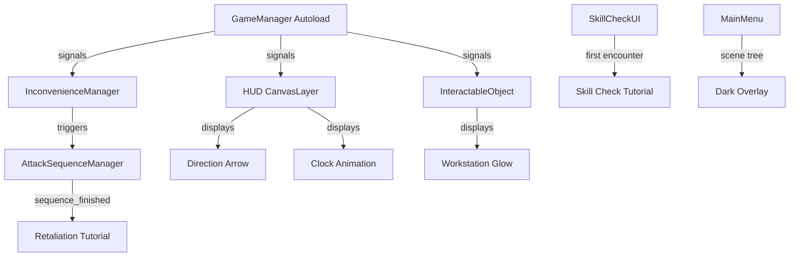

# Design Document: UI Polish and Tutorials

## Overview

This design covers seven UI improvements for "Return to Work, PLEASE!" that enhance visual clarity, replace placeholder text elements with sprite-based visuals, add contextual tutorials, and restyle the attack sequence panel. The changes span the Main Menu, HUD, InteractableObject workstations, SkillCheckUI, LoopTutorial, and AttackSequenceManager systems.

All modifications target existing GDScript files and `.tscn` scenes in the Godot 4 project. No new autoloads or architectural changes are required — each requirement maps to localized edits within the existing scene tree and script structure.

## Architecture

The game uses a layered architecture:



**Key architectural decisions:**

1. **No new autoloads** — Tutorial state flags (`_skill_check_seen`, `_first_attack_seen`) live on the relevant manager scripts (SkillCheckUI and AttackSequenceManager respectively). They reset when `GameManager.reset_game_state()` is called.

2. **Scene tree ordering matters** — The main menu dark overlay must sit between BackgroundRect and LogoRect in the scene tree to darken only the background.

3. **Preloaded textures** — Clock frames (241 PNGs) are loaded on-demand via `load()` with frame index, not preloaded all at once, to avoid memory bloat.

4. **Signal-driven glow** — The workstation always-on glow listens to `GameManager.current_task_changed` rather than relying on player proximity detection.

## Components and Interfaces

### 1. Main Menu Dark Overlay (MainMenu.tscn / MainMenu.gd)

**Change:** Add a `ColorRect` node named `DarkOverlay` in the MainMenu scene tree.

- **Position in tree:** After `BackgroundRect`, before `LogoRect`
- **Configuration:** `anchors_preset = PRESET_FULL_RECT`, `color = Color(0, 0, 0, 0.4)`
- **Implementation:** Static scene node — no script changes needed. Added directly to `MainMenu.tscn`.

### 2. Workstation Always-On Glow (InteractableObject.gd)

**Change:** Modify the glow logic so the highlight rect flashes whenever this workstation's `task_id` matches `GameManager.get_current_task_id()`, regardless of player proximity.

- **New signal connection:** `GameManager.current_task_changed` → `_on_task_changed` (already exists, extend logic)
- **New signal connection:** `GameManager.all_objectives_completed` → `_on_all_completed` (stop all glows)
- **Modified methods:**
  - `_on_task_changed(idx)` — Start glow if `task_id == GameManager.get_current_task_id()`, stop otherwise
  - `_on_body_entered` / `_on_body_exited` — No longer control glow start/stop; only control prompt visibility
  - New `_update_glow_state()` helper that checks active task match

**Interface:**
```gdscript
func _update_glow_state() -> void
    # If task_id matches current active task → _start_glow()
    # Otherwise → _stop_glow()
```

### 3. Sprite-Based Direction Arrow (HUD.gd)

**Change:** Replace the `Label` node (`direction_arrow`) with a `TextureRect` using `res://Assets/ARROW.png`.

- **Node type change:** `Label` → `TextureRect`
- **Rotation-based direction:** Instead of setting `.text` to arrow characters, set `rotation_degrees`:
  - Right: `0°`
  - Left: `180°`
  - Up: `270°`
  - Down: `90°`
- **Flash animation:** Same tween on `modulate:a` (0.4 → 1.0 over 0.9s cycle)
- **Sizing:** `custom_minimum_size = Vector2(48, 48)`, `expand_mode = EXPAND_KEEP_SIZE`, `pivot_offset` centered for rotation

**Modified methods:**
- `_ready()` — Create `TextureRect` instead of `Label`, load `ARROW.png`
- `_set_arrow_side(is_left)` — Set `rotation_degrees` instead of `.text`
- `_update_direction_arrow()` — Set rotation for elevator up/down cases

### 4. Animated Clock Deadline Indicator (HUD.gd)

**Change:** Replace the dynamically created `deadline_label: Label` with a `TextureRect` that displays clock frames.

- **Frame loading strategy:** Load frames on-demand: `load("res://Assets/clock/time/time_%03d.png" % frame_idx)`
- **Frame calculation:** `frame_idx = clampi(int((elapsed / total) * 240), 0, 240)` where `elapsed = total_deadline - remaining`
- **Visibility:** Hidden when `!GameManager.is_deadline_active`
- **Position:** Top-center, anchors `PRESET_CENTER_TOP`, `offset_top = 20`

**Modified methods:**
- `_ready()` — Create `TextureRect` instead of `Label` for deadline display
- `_process(delta)` — Calculate frame index from deadline progress, update texture

**Interface:**
```gdscript
var clock_rect: TextureRect  # Replaces deadline_label
var _clock_frames_cache: Dictionary = {}  # Optional: cache loaded textures

func _get_clock_frame(index: int) -> Texture2D:
    # Load and optionally cache the frame texture
```

### 5. Skill Check Tutorial Overlay (SkillCheckUI.gd + new scene)

**Change:** Before the first skill check in a session, display a tutorial overlay explaining the QTE mechanic.

- **State flag:** `var _skill_check_tutorial_seen: bool = false` on SkillCheckUI
- **Tutorial scene:** New `CanvasLayer` node created programmatically (or a small `.tscn`)
- **Content:**
  - Full-screen `ColorRect` with `Color(0, 0, 0, 0.85)`
  - Instructional text label (centered, white, pixel font)
  - Static visual example: duplicate of the QTE bar showing indicator in yellow zone
  - "Press Space to continue" prompt
- **Process mode:** Tutorial node uses `PROCESS_MODE_ALWAYS`; game tree is paused during display
- **Dismissal:** Space or Enter → free tutorial, call `start_skill_check()`
- **Reset:** Flag resets in a new method `reset_tutorial_state()` called from `GameManager.reset_game_state()`

**Interface:**
```gdscript
func begin_skill_check(base_speed: float = 400.0) -> void:
    # Public entry point (replaces direct start_skill_check calls)
    if not _skill_check_tutorial_seen:
        _show_tutorial(base_speed)
    else:
        start_skill_check(base_speed)

func _show_tutorial(pending_speed: float) -> void
func _dismiss_tutorial() -> void
func reset_tutorial_state() -> void
```

### 6. Retaliation Tutorial Trigger Change (AttackSequenceManager.gd)

**Change:** Move the retaliation tutorial trigger from loop 2 start to after the first attack sequence completes.

- **State flag:** `var _first_attack_seen: bool = false` on AttackSequenceManager
- **Trigger point:** In `_finish_attack()`, after `sequence_finished.emit()`, check if this is the first attack
- **Delay:** 0.3 second timer before instantiating `LoopTutorial.tscn`
- **Reset:** Flag resets in a new method `reset_attack_state()` called from `GameManager.reset_game_state()`
- **Removal:** Remove the existing loop 2 tutorial trigger (wherever it currently lives — likely in `Main.gd` or a loop restart handler)

**Interface:**
```gdscript
func _finish_attack() -> void:
    # ... existing cleanup ...
    sequence_finished.emit()
    if not _first_attack_seen:
        _first_attack_seen = true
        _show_retaliation_tutorial()

func _show_retaliation_tutorial() -> void:
    # Wait 0.3s then instantiate LoopTutorial scene
    
func reset_attack_state() -> void:
    _first_attack_seen = false
```

### 7. Attack Sequence CMD Panel (AttackSequenceManager.gd)

**Change:** Replace the programmatically built `fake_console` TextEdit and plain `ColorRect` overlay with a `TextureRect` using `CMD.png` as the panel background.

- **Panel structure:**
  - `TextureRect` with `res://Assets/CMD.png` as texture (replaces `ColorRect` overlay area for the console)
  - Title bar text "COMMAND PROMPT" in white pixel font at top
  - Body area: text rendered in white `Color(1, 1, 1, 1)` instead of green
  - Maintains same screen positioning and proportions
- **Text color change:** All text within the panel uses white instead of green
- **Layout:** Same anchors/offsets as current `fake_console` but wrapped in the CMD texture

**Modified methods:**
- `_setup_ui()` — Replace `TextEdit` creation with `TextureRect` + `Label` for typed text
- Console text typing logic remains the same, just targets a `Label` or `RichTextLabel` instead of `TextEdit`

## Data Models

No persistent data model changes. All state is transient (per-session):

| Flag | Location | Type | Reset Trigger |
|------|----------|------|---------------|
| `_skill_check_tutorial_seen` | SkillCheckUI | `bool` | `GameManager.reset_game_state()` |
| `_first_attack_seen` | AttackSequenceManager | `bool` | `GameManager.reset_game_state()` |

**Clock frame path pattern:** `res://Assets/clock/time/time_%03d.png` (000–240, 241 frames total)

**Arrow sprite path:** `res://Assets/ARROW.png`

**CMD panel path:** `res://Assets/CMD.png`

## Error Handling

| Scenario | Handling |
|----------|----------|
| Clock frame texture fails to load | Fall back to hiding the clock rect; print warning |
| ARROW.png missing | Fall back to hidden direction arrow; print warning |
| CMD.png missing | Fall back to existing ColorRect-based panel; print warning |
| Frame index out of bounds (clock) | `clampi(index, 0, 240)` prevents OOB access |
| Player in unknown slot (direction arrow) | Hide arrow, stop flash — existing behavior preserved |
| Tutorial dismissed during scene transition | `queue_free()` handles cleanup; paused state restored in `_finish_tutorial()` |
| `reset_game_state()` called mid-tutorial | Tutorial `queue_free()` + flag reset ensures clean state |

## Testing Strategy

**Why PBT does not apply:** This feature consists entirely of UI rendering changes (overlays, sprite swaps, scene tree ordering), visual animations (glow tweens, clock frame updates), and event-driven tutorial triggers. There are no pure functions with meaningful input variation, no serialization, no data transformations, and no algorithmic logic that would benefit from property-based testing. The behavior is deterministic given specific game states.

**Recommended testing approach:**

### Manual Playtesting Checklist

1. **Main Menu Overlay**
   - Launch game → verify background is visibly darkened
   - Verify logo and buttons render on top of the overlay (not darkened)

2. **Workstation Glow**
   - Start a task → verify the target workstation glows yellow even when player is far away
   - Complete a task → verify old workstation stops glowing, new one starts
   - Complete all tasks → verify no workstations glow

3. **Direction Arrow**
   - Navigate between rooms → verify pixelated yellow arrow sprite rotates correctly
   - Enter elevator → verify arrow points up/down appropriately
   - Arrive at task room → verify arrow hides
   - Verify flash animation matches previous behavior

4. **Clock Animation**
   - Start a task with deadline → verify clock appears at frame 0
   - Wait for deadline to progress → verify clock animates through frames
   - Let deadline expire → verify frame 240 displays
   - Complete task before deadline → verify clock resets for next task

5. **Skill Check Tutorial**
   - Trigger first skill check → verify tutorial overlay appears with instructions
   - Press Space → verify tutorial dismisses and skill check begins
   - Trigger second skill check → verify tutorial does NOT appear
   - Return to main menu and restart → verify tutorial appears again

6. **Retaliation Tutorial**
   - Play through loop 1 → verify NO retaliation tutorial at loop 2 start
   - Wait for first NPC attack → verify retaliation tutorial appears after attack completes
   - Continue playing → verify tutorial does NOT appear on subsequent attacks
   - Restart game → verify tutorial can appear again

7. **CMD Panel**
   - Trigger an attack sequence → verify CMD.png panel appears with white text
   - Verify "COMMAND PROMPT" title bar is visible
   - Verify typed commands appear in white (not green)
   - Verify panel sizing matches previous layout

### Unit Tests (Example-Based)

For the clock frame calculation logic (the one piece of pure computation):

```gdscript
# test_clock_frame_index.gd
func test_frame_at_start():
    assert_eq(_calculate_frame(0.0, 24.0), 0)

func test_frame_at_midpoint():
    assert_eq(_calculate_frame(12.0, 24.0), 120)

func test_frame_at_end():
    assert_eq(_calculate_frame(24.0, 24.0), 240)

func test_frame_clamped_over():
    assert_eq(_calculate_frame(30.0, 24.0), 240)

func test_frame_clamped_negative():
    assert_eq(_calculate_frame(-5.0, 24.0), 0)
```

### Integration Verification

- Verify `GameManager.reset_game_state()` properly resets both tutorial flags
- Verify `sequence_finished` signal fires correctly after attack sequence
- Verify scene tree order in MainMenu.tscn places DarkOverlay between BackgroundRect and LogoRect
